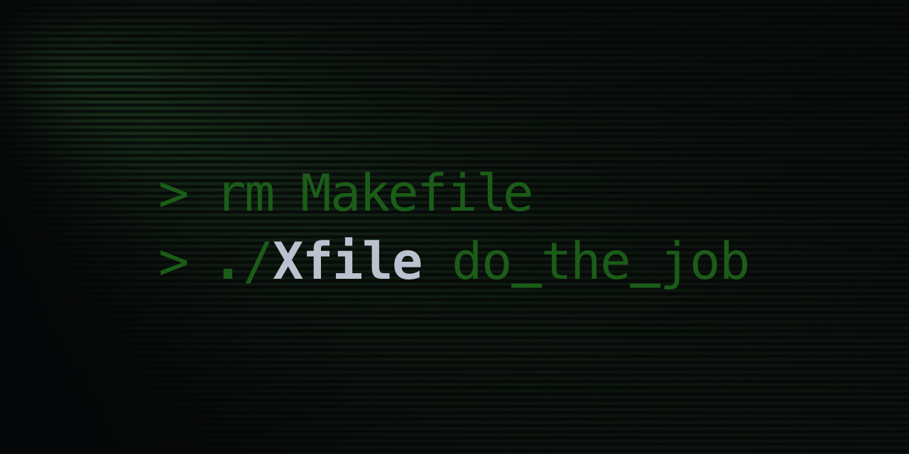
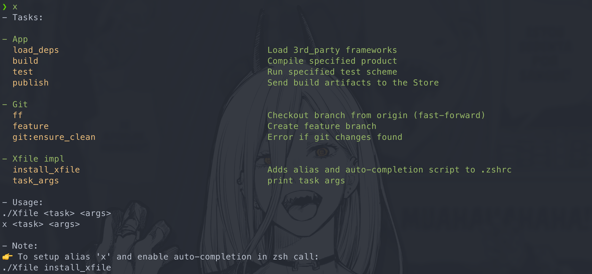

# Xfile

Simple `bash` template for scripting.

Aimed to replace widespread `Makefile` misuse as a repo commands launcher.



- [Xfile](#xfile)
  - [Repo content](#repo-content)
  - [Install Xfile](#install-xfile)
    - [Xfile template](#xfile-template)
    - [Interactive shell (alias and autocomplete)](#interactive-shell-alias-and-autocomplete)
    - [Non-interactive shell](#non-interactive-shell)
  - [Use Xfile](#use-xfile)
    - [Task](#task)
    - [Arguments](#arguments)
    - [Help](#help)
  - [Write Xfile](#write-xfile)
    - [Xfile structure](#xfile-structure)
    - [Task](#task-1)
    - [Task visibility](#task-visibility)
    - [Child task](#child-task)
    - [Arguments](#arguments-1)
    - [ENV](#env)
    - [Credentials](#credentials)
  - [Motivation](#motivation)
    - [About Makefile](#about-makefile)
    - [About Xfile](#about-xfile)
  - [Naming](#naming)
  - [Links](#links)

## Repo content

Xfile implementation in `Xfile_source`:
  - impl.sh – common core tasks
  - xlib.sh – helpers for args handling
  - tests.sh – tasks for impl/xlib testing
  - completion.sh – alias and autocomplete for interactive shell

Samples:
  - Xfile (git and iOS development tasks)
  - git hooks
  - scripts: bash, ruby, fastlane, swift code

## Install Xfile

### Xfile template

For fresh start in your repository run script:
```sh
curl -fsSL "https://raw.githubusercontent.com/amidaleet/Xfile/4.0.0/Xfile_source/setup.sh" -o "setup.sh" # load setup script to local file
chmod +x setup.sh # make script executable
./setup.sh # load files with script
rm -f setup.sh # remove setup script
```

Or you can clone this **this** repository and call command from it's root dir.
```sh
# Will create plain Xfile and copy impl files to provided directory
./Xfile impl:xfile_init_copy --path "$HOME/Developer/my-app-repository"
```

### Interactive shell (alias and autocomplete)

Xfile provides interactive terminal features: short alias and autocompletion.

Autocompletion shows declared args of the task as you type space after it's name or other args.


Install it to `~/.zshrc` with command:
```sh
./Xfile install_xfile && exec zsh -l
```

After that Xfile commands can be called from directory with Xfile.
```sh
# Use '&&' to run task chain in fail-fast manner
x setup && x generate_project && x build_app

# Or ';' if errors must not stop next tasks in chain
x unit_tests; x snapshot_tests; x collect_test_reports
```

### Non-interactive shell

Not setup needed!

For example in CI pipeline it can be called as bash script file, without alias.
```sh
./Xfile run_my_task
```

## Use Xfile

Samples in this repo is pretty self-explanatory.

### Task

Task launch looks like as a function call.

```sh
x run_my_script
```

### Arguments

Args can be provided in different forms, without ENV pollution.

```sh
# Makefile-styled parametrized calls

x install_xcode VERSION=15.4 COOKIE='NG2H6...'
x install_ios_runtime VERSION=17.2 COOKIE='cm123...'
```

```sh
# Named arguments

x sync_branches --from origin --to new_store --branches "main release/1.2.0 release/1.0.0"
```

Multiple spaces in quated value is supported with parser.

```sh
# Short name

x feature -t "PROJECT-1000" -i 2
```

```sh
# Short, long, flag

x feature -t "PROJECT-1000" --index 2 --cherry-pick
```

```sh
# Positional

x rebase main
```

```sh
# Flags

x install_homebrew_deps --infra
x ff main --force
```

Function may work as helper wrapper downstreaming all passed arguments.

Change directory, apply config, set venv etc.
```sh
x cocoapods install
```

### Help

Makefile-styled documentation for declared tasks is built-in.

'help' is the default task:
```sh
x help

# or simply:
x
```



## Write Xfile

I briefly explain Xfile work logic by examples. For more info about bash features and scripting technics see [Links](#links) and other sources.

### Xfile structure

`Xfile` stores multiple scripts as a function list.

Each function can be executed as a `task` in it's own bash process.

Sample template with commentary:
```sh
#!/usr/bin/env bash # 👀 Tells shell to which binary this file have to be send for interpretation

set -eo pipefail # 👀 Recommended bash setting, can be customized
source "Xfile_source/impl.sh" # 👀 'Copies' implementation script to Xfile body

export GIT_ROOT="$(realpath .)" # 👀 ENV and process values setting may be placed anywhere

# ---------- Block ---------- # 👀 Splits tasks in help

# 👀 Doc comments can be written in any script part
#
# 👀 Optional space-separated args list for autocompletion goes on row above function declaration
## --flag value= -i
function any_task_you_want_to_add { ## 👀 One line note about task meaning
  log 'Simple text logging'
  log_info 'Noticeable text'
  log_warn Warning
  log_error Error!
  log_success Success!
  read_opt -w --wildcard WILDCARD
  read_args ARG1 ARG2
  assert_defined ARG1 ARG2
  if read_flags --flag; then log true; fi
  # 👀 ^^^ helper functions from xlib
}

run_task "$@" # 👀 Starts input handling, calls specified task
```

### Task

`task` launches `Xfile` function as a bash sub-process.

Xfile logs when script jumps in and out between tasks.


Command arguments passed to the parent task call is not visible in children scopes.

```sh
function run_ci_pipe {
  read_args val
  echo "val=$val" # 👀 value from terminal command, ex: 'x run_ci_pipe val=123' -> '123'

  task load_3rd_parties
  task build val=build
  task test val=test

  log_success "Pipe succeeded!"
}

function load_3rd_parties {
  read_args val
  echo "val=$val" # 👀 '', value is not provided in task call
}

function build {
  read_args val
  echo "val=$val" # 👀 'build'
}

function test {
  read_args val
  echo "val=$val" # 👀 'test'
}
```

Functions can be called without `task`, however it will break Xfile argument handling helpers.

```sh
function run_ci_pipe {
  build val='This is not visible in child!'
}

function build {
  read_args val # 👀 Searches in the process input, not in the function's one
  echo "$val" # 👀 '' or 'smth' (if process started with arg that have same name, ex: 'x run_ci_pipe val=smth')
}
```

### Task visibility

All functions you declare directly in Xfile or in a script imported with `source` command (like `impl` and `xlib`) will be available in the script scope.

You can execute it from command line.

```sh
x log "Some words" # task defined in Xfile_source/xlib
x task_args my_function # task defined in Xfile_source/impl
```

You can `source` additional scripts with tasks definition.

And redefine your `Xfile` `help` function to get plugin tasks listed in `help` output.

It may be useful to allow place user defined extension file with ENV and tasks in your repo (added to `.gitignore`), like:

```sh
if [ -f ./xprofile ]; then source ./xprofile; fi

function help { ## Print tasks description
  show_tasks_from "$0" "💪 Common Xfile tasks:"
  log_blank_line
  show_tasks_from xprofile "👤 Personal xprofile tasks:"
  log_blank_line
  usage
}
```

If you want to define utility function that not meant to be called as task, you can define it without function keyword:

```sh
copy_commit_msg() {
  git show -s --format='%B' | pbcopy
}
```

It won't be listed in the `help` output.

However it will be present in scope and still can be called via `x`.

```sh
x copy_commit_msg ## works as task
```

To minimize the risk of unwanted calls, use naming:

```sh
_copy_commit_msg() {}
private:copy_commit_msg() {}
```

### Child task

Instead of sourcing all the Xfiles as plugins in your main Xfile, it may be convenient to define wrapper task functions and invoke child_task on demand.

- Thats prevents scope pollution and sourcing overhead.
- Also task names collision is not a problem with this method.

```sh
## --upgrade
function brew:install_ios_utils_from_brew { ## Install repo deps with brew. Sample: x brew:install_ios_utils_from_brew --upgrade
  child_task "$SCRIPTS_FOLDER/brew_x.sh" install_deps ## Will put original task args to call (after the given brew task name)
}

function brew_task { ## Forward any task to brew_x Xfile. Sample: x brew_task install_deps --upgrade
  child_task "$SCRIPTS_FOLDER/brew_x.sh" ## Will put original task args to call
}
```

### Arguments

Each task can look up for expected arguments in the input line.

`xlib.sh` provides helper function for this purposes.

Simple function may use bash built-in positional args:

```sh
function rebase {
  local BRANCH=${1-main} # 👀 like nil-coalescing operator, main is default value

  git fetch origin $BRANCH
  git rebase -i origin/$BRANCH
}
```

Terminal calls:

```sh
x rebase main
x rebase
```

Args can be Makefile-styled (name + equal sign + value string).
```sh
function install_ios_runtime {
  read_args VERSION COOKIE # 👀 Search make-like syntax VERSION='value  can have many spaces if quoted' and COOKIE=1243
  assert_defined VERSION COOKIE # 👀 Checks if values exist in the scope and they are not empty

  "$SCRIPTS_FOLDER/install_ios_runtime.sh" -v "$VERSION" -c "$COOKIE"
}
```

Terminal calls:

```sh
x install_ios_runtime VERSION=17.2 COOKIE='123456...'
```

Args can be getopts-styled (--name + space + valuer string).
```sh
function jenkins_job_get_script {
  read_opt -n --name job_name # 👀 Search for both long and short form
  assert_defined job_name jenkins_creds # 👀 Check if required values is ether in parsed args or ENV

  log_info "Loading script for $job_name"

  curl "$X_JENKINS_JOB_LIST_URL/${job_name}/config.xml" \
    -u "$jenkins_creds" \
    -o "$X_JENKINS_JOB_CONFIGS_DIR/${job_name}.xml" \
    --show-error \
    --fail

  log_success "Loaded script for $job_name"
}
```

Terminal calls:

```sh
 export jenkins_creds='u:token'
 export X_JENKINS_JOB_LIST_URL='example.com'
x jenkins_job_get_script --name 'Debug Job'
unset jenkins_creds; unset X_JENKINS_JOB_LIST_URL
```

Args can be used as flags (check if provided or not).

```sh
function git:reset_retained_lfs_files {
  if ! read_flags --lose-unstaged-changes; then # 👀 Checks bool value
    log_warn "
    This call will remove all unstaged files!

    1) Use git add to save necessary changes
    2) Call again with --lose-unstaged-changes arg to confirm unstaged diff loss
    "
    return
  fi

  local attributes_backup="$(cat .gitattributes)"

  echo -n "" >.gitattributes

  local files="$(git diff --name-only | grep -v '.gitattributes' || true)"
  log "$files"

  echo "$files" | tr \\n \\0 | xargs -0 git checkout HEAD --
  echo "$attributes_backup" >.gitattributes

  log_success "Pointer-less LFS files must disappear"
}
```

### ENV

You can export values to executed processes and commands.

```sh
export GIT_ROOT="$(realpath .)" # visible in sub-processes
SCRIPTS_FOLDER="tools/sh" # visible in the Xfile scope only

function rubocop {
  "$SCRIPTS_FOLDER/rubocopw.sh" "$@"
  # rubocopw.sh code can reed GIT_ROOT but not SCRIPTS_FOLDER
}
```

### Credentials

It is better not to use arguments for token or password passage. As strings will stay unprotected in Terminal session history.

Configure your history file to ignore space prefixed commands.
```sh
setopt HIST_IGNORE_DUPS      # Do not record an event that was just recorded again.
setopt HIST_IGNORE_SPACE     # Do not record an event starting with a space.
```

And put creds in the ENV instead:
```sh
 export SUDO_PASS='123'
x install_system_software "Some Soft 2.0"
unset SUDO_PASS
```

You can work with ENV value as with simple task argument.
```sh
function install_system_software {
  assert_defined SUDO_PASS

  echo "$SUDO_PASS" | sudo -S installer -pkg "$1" -target /
}
```

## Motivation

### About Makefile

Makefile is a tool for build automation, typically used for C code compilation. It has it's own syntax and interpreter. It's ability to run bash commands in `.PHONY` targets without making/modifying files is actually a side effect.

Also Makefile is widely used as a bucket for shell commands aliases in git repositories, an entry point for committed scripts. Especially in iOS development bubble.

I see next reasons for that:
- `make` binary is built-in – no need to setup (for MacOS at least)
- `Makefile` is a common solution so it is likely to be reused
- syntax is simple for short and non-parametrized commands

It works in simple scenarios that can be hardcoded. But lucks arguments reading support.

Bash power of structural programming (loops, conditions, vars, arrays) is not available in Makefile source code.

### About Xfile

Why run `bash (terminal) -> Makefile -> bash (script).`, if `bash.` possible?

Makefile use case described above can be implemented with pure bash script.

Xfile goals and benefits:
- make it easy to run shell scripts from the active directory
- simple template for sharing reusable commands, scripts and environment setup
- support parameters passing in various form including flags and optional args (*both make- and getopts- like style*)
- build-in help documentation and args completion in Terminal
- make structural programming bash syntax available in task declaration scope itself
- does not adds any new abstraction layer between commands and scripts

## Naming

"x" stands for eXecute.

It is shortest meaningful alias for command.

Also name distinguishes Xfile from existing Taskfile (YAML config tool).

## Links

More context:
- [Stop Using Makefile](https://dev.to/calvinmclean/stop-using-makefile-use-taskfile-instead-4hm9) – why Makefile is bad practice
- [Taskfile (bash)](https://github.com/adriancooney/Taskfile) – Xfile "parent" and the source of inspiration, blank bash snippet for storing multiple tasks in one script
- [Shell History](https://martinheinz.dev/blog/110)
