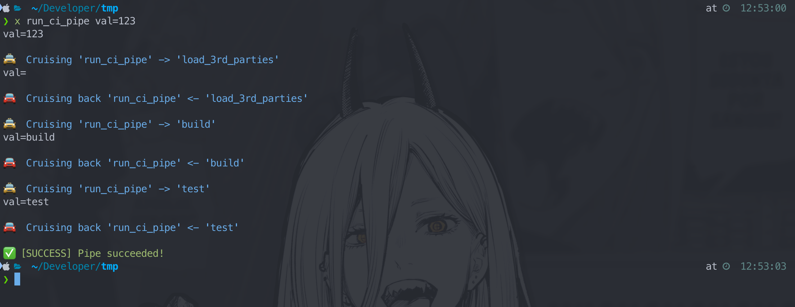

# Xfile

Simple `bash` template for efficient scripting.


- [Xfile](#xfile)
  - [Motivation](#motivation)
    - [Naming](#naming)
    - [Links](#links)
  - [Repo content](#repo-content)
  - [Install Xfile](#install-xfile)
    - [Xfile template](#xfile-template)
    - [Interactive shell (alias and autocomplete)](#interactive-shell-alias-and-autocomplete)
    - [Non-interactive shell](#non-interactive-shell)
  - [Use Xfile](#use-xfile)
    - [Task](#task)
    - [Arguments](#arguments)
    - [Help](#help)
  - [Write Xfile](#write-xfile)
    - [Xfile structure](#xfile-structure)
    - [Declare task](#declare-task)
    - [Read arguments](#read-arguments)
    - [Use ENV](#use-env)
      - [Credentials](#credentials)
    - [Task visibility](#task-visibility)
      - [Load tasks from source](#load-tasks-from-source)
      - [Link children](#link-children)

## Motivation

Xfile aimed to be:
- solid foundation for repository tools API stability:
  - ENV setup point for all repository scripts
  - CLI API facade for all repository scripts
- SDK for bash scripting, with built-in features:
  - argument readers in various forms (including flags and optional args)
  - help and documentation features
  - task names and args completion for Terminal.app
  - logs of task stack
  - logs of exit code and failed command
  - fast execution of tasks inside the other task (cause 'task' call typically resolved as function call inside same shell process)

Xfile original goal was to replace `Makefile` as a repo scripts launcher (which is a misuse of Makefile).

- Makefile is a tool for build automation, specifically for C code compilation.
- Makefile ability to run shell commands in `.PHONY` targets without making/modifying files is actually a side job.
- Makefile is not a shell script – it has it's own syntax and interpreter.
- Bash power of structural programming (loops, conditions, vars, arrays, etc.) is not available in Makefile.

Makefile should never be used as a bucket for shell commands in git repositories!

Why run `bash [Terminal] -> Makefile -> bash [script].`, if just `bash.` possible?

### Naming

"x" stands for eXecute. It is shortest meaningful alias for command.

Also name distinguishes Xfile from existing Taskfile (YAML config tool).

### Links

More context:
- [Stop Using Makefile](https://dev.to/calvinmclean/stop-using-makefile-use-taskfile-instead-4hm9) – why Makefile is bad practice
- [Taskfile (bash)](https://github.com/adriancooney/Taskfile) – source of inspiration, blank bash snippet for storing multiple tasks in one script
- [Shell History](https://martinheinz.dev/blog/110)

## Repo content

Whole required Xfile implementation located in a `./Xfile_source`:
  - impl.sh – Xfile core functions
  - xlib.sh – helpers, may be used in any bash script
  - completion.sh – alias and autocomplete for interactive shell setup (for `.*rc` files)
  - template.sh – sample Xfile with minimum code for quick start from scratch
  - tests/tests.sh – tasks for `impl.sh` and `xlib.sh` testing

Sample code:
  - Xfile – task declaration examples
  - tools/hooks/ – git hooks (LFS, pre-commit, prepare-commit-msg)
  - tools/sh/ – bash scripts, Xfile children and sources (git, brew, ruby, jenkins, Xcode, iOS runtime tasks samples)
  - tools/swift/ – swift scripts
  - fastlane/ – ruby and fastlane scripts

## Install Xfile

### Xfile template

For fresh start in your repository run script:
```sh
(export XFILE_REF='main'; bash <<<$(curl -fsSL "https://raw.githubusercontent.com/amidaleet/Xfile/${XFILE_REF}/Xfile_source/setup.sh"))
```

Or you can clone this **this** repository and call command from it's root dir.
```sh
git clone git@github.com:amidaleet/Xfile.git ./Xfile # clone repo
cd Xfile # move to this repo root
./Xfile xfile_init_copy "$HOME/Developer/my-repository" # create Xfile from template and copy Xfile_source to provided directory
```

### Interactive shell (alias and autocomplete)

Xfile provides interactive terminal features: short alias and autocompletion.

Autocompletion shows declared args of the task as you type space after it's name or other args.

Completion is tested in `Terminal.app` and `iTerm.app` with `bash`, `zsh` and `Oh-My-Zsh`.

Completion suggests task names:


And task arguments:


Install completion script to `HOME` with command:
```sh
./Xfile install_xfile
```

Then source in `.zshrc` or `.bashrc`/`.bash_profile` like:
```sh
source "$HOME/.xfile_completion"
```

After that Xfile commands can be called from directory with Xfile.
```sh
# Use '&&' to run task chain in fail-fast manner
x setup && x generate_project && x build_app

# Or ';' if errors must not stop next tasks in chain
x unit_tests; x snapshot_tests; x collect_test_reports
```

### Non-interactive shell

No setup is required!

For example, in CI pipeline Xfile can be called as executable file by path, without alias:
```sh
./Xfile run_my_task
```

## Use Xfile

Samples in this repo is pretty self-explanatory.

### Task

Task launch looks like as a function call.

```sh
x run_my_script
```

### Arguments

Args can be provided in different forms, without ENV pollution.

```sh
# Makefile-styled parametrized calls

x install_xcode VERSION=15.4 COOKIE='NG2H6...'
x install_ios_runtime VERSION=17.2 COOKIE='cm123...'
```

```sh
# Named arguments

x sync_branches --from origin --to new_store --branches "main release/1.2.0 release/1.0.0"
```

Multiple spaces in quoted value is supported with parser.

```sh
# Short name

x feature -t "PROJECT-1000" -i 2
```

```sh
# Short, long, flag

x feature -t "PROJECT-1000" --index 2 --cherry-pick
```

```sh
# Positional

x rebase main
```

```sh
# Flags

x install_homebrew_deps --infra
x ff main --force
```

Function may work as helper wrapper that downstream all passed arguments.

Change directory, apply config, set venv etc.
```sh
x cocoapods install
```

### Help

Makefile-styled documentation for declared tasks is built-in.

'help' is the default task, all of above calls launch 'help' task.
```sh
x help
x -h
x --help
x
```


## Write Xfile

I briefly explain Xfile work logic by examples. For more info about bash features and scripting technics see [Links](#links) and other sources.

### Xfile structure

`Xfile` stores multiple scripts as a function list.

Each function can be executed as:
- `task` – meaning simple call of specified function
- `process` – new bash process that will call specified function

`process` may be required if your put your function call inside a logical evaluation and want to persist `errexit` behavior inside called function body.

`Xfile` is designed to work with `errexit` option (`set -e`).

Sample template with commentary:
```sh
#!/usr/bin/env bash # 👀 Tells shell to which binary this file have to be send for interpretation

set -eo pipefail # 👀 Recommended bash options, can be customized

source "Xfile_source/impl.sh" # 👀 'Copies' implementation script to Xfile body

export GIT_ROOT="${GIT_ROOT:-"${PWD:-"$(pwd)"}"}" # 👀 ENV and process values setting may be placed anywhere

# ---------- Block ---------- # 👀 Splits tasks in help

# 👀 Doc comments can be written in any script part
#
# 👀 Optional space-separated args list for autocompletion goes on row above function declaration
## --flag value= -i
function any_task_you_want_to_add { ## 👀 One line note about task meaning
  log 'Simple text logging'
  log_info 'Noticeable text'
  log_warn Warning
  log_error Error!
  log_success Success!
  local WILDCARD ARG1 ARG2 # 👀 you typically want to limit variables visibility only to this func (and upper call stack part)
  read_opt -w --wildcard WILDCARD
  read_args ARG1 ARG2
  assert_defined ARG1 ARG2
  if read_flags --flag; then log true; fi
  # 👀 ^^^ helper functions from xlib
}

begin_xfile_task # 👀 Starts input handling, calls task specified in script args
```

### Declare task

`task` – `Xfile` function (or func from "child" script).

Xfile logs when script jumps in and out between tasks:



If error exit occurs, code and throwing command are automatically displayed:


Command arguments passed to the parent task call is not visible in children scopes.

```sh
function run_ci_pipe {
  local val
  read_args val
  echo "val=$val" # 👀 value from terminal command, ex: 'x run_ci_pipe val=123' -> '123'

  task load_3rd_parties
  task build val=build
  task test val=test

  log_success "Pipe succeeded!"
}

function load_3rd_parties {
  local val
  read_args val
  echo "val=$val" # 👀 '', value is not provided in task call
}

function build {
  local val
  read_args val
  echo "val=$val" # 👀 'build'
}

function test {
  local val
  read_args val
  echo "val=$val" # 👀 'test'
}
```

Functions can be called without `task`, however it will break Xfile argument handling helpers.

```sh
function run_ci_pipe {
  build val='This is not visible in child!'
}

function build {
  local val
  read_args val # 👀 Searches in the process input, not in the function's one
  echo "$val" # 👀 '' or 'smth' (if process started with arg that have same name, ex: 'x run_ci_pipe val=smth')
}
```

### Read arguments

Each task can look up for expected arguments in the input line.

`xlib.sh` provides helper function for this purposes.

Simple function may use bash built-in positional args:

```sh
function rebase {
  local BRANCH=${1-main} # 👀 like nil-coalescing operator, main is default value

  git fetch origin "$BRANCH"
  git rebase -i "origin/$BRANCH"
}
```

Terminal calls:

```sh
x rebase main
x rebase
```

Args can be Makefile-styled (name + equal sign + value string).
```sh
function install_ios_runtime {
  local VERSION COOKIE
  read_args VERSION COOKIE # 👀 Search make-like syntax VERSION='value  can have many spaces if quoted' and COOKIE=1243
  assert_defined VERSION COOKIE # 👀 Checks if values exist in the scope and they are not empty

  "$SCRIPTS_FOLDER/install_ios_runtime.sh" -v "$VERSION" -c "$COOKIE"
}
```

Terminal calls:

```sh
x install_ios_runtime VERSION=17.2 COOKIE='123456...'
```

Args can be getopts-styled (--name + space + valuer string).
```sh
function jenkins_job_get_script {
  local job_name
  read_opt -n --name job_name # 👀 Search for both long and short form
  assert_defined job_name jenkins_creds # 👀 Check if required values is ether in parsed args or ENV

  log_info "Loading script for $job_name"

  curl "$X_JENKINS_JOB_LIST_URL/${job_name}/config.xml" \
    -u "$jenkins_creds" \
    -o "$X_JENKINS_JOB_CONFIGS_DIR/${job_name}.xml" \
    --show-error \
    --fail

  log_success "Loaded script for $job_name"
}
```

Terminal calls:

```sh
 export jenkins_creds='u:token'
 export X_JENKINS_JOB_LIST_URL='example.com'
x jenkins_job_get_script --name 'Debug Job'
unset jenkins_creds; unset X_JENKINS_JOB_LIST_URL
```

Args can be used as flags (check if provided or not).

```sh
function git:reset_retained_lfs_files {
  if ! read_flags --lose-unstaged-changes; then # 👀 Checks bool value
    log_warn "
    This call will remove all unstaged files!

    1) Use git add to save necessary changes
    2) Call again with --lose-unstaged-changes arg to confirm unstaged diff loss
    "
    return
  fi

  local attributes_backup="$(cat .gitattributes)"

  echo -n "" >.gitattributes

  local files="$(git diff --name-only | grep -v '.gitattributes' || true)"
  log "$files"

  echo "$files" | tr \\n \\0 | xargs -0 git checkout HEAD --
  echo "$attributes_backup" >.gitattributes

  log_success "Pointer-less LFS files must disappear"
}
```

### Use ENV

You can export values to executed processes and commands.

```sh
export GIT_ROOT="${GIT_ROOT:-"${PWD:-"$(pwd)"}"}" # visible in sub-processes
SCRIPTS_FOLDER="tools/sh" # visible in the Xfile scope only

function rubocop {
  "$SCRIPTS_FOLDER/rubocopw.sh" "$@"
  # rubocopw.sh code can reed GIT_ROOT but not SCRIPTS_FOLDER
}
```

#### Credentials

It is better not to use arguments for token or password passage. As strings will stay unprotected in Terminal session history.

Configure your history file to ignore space prefixed commands.
```sh
setopt HIST_IGNORE_DUPS      # Do not record an event that was just recorded again.
setopt HIST_IGNORE_SPACE     # Do not record an event starting with a space.
```

And put creds in the ENV instead:
```sh
 export SUDO_PASS='123'
x install_system_software "Some Soft 2.0"
unset SUDO_PASS
```

You can work with ENV value as with simple task argument.
```sh
function install_system_software {
  assert_defined SUDO_PASS

  echo "$SUDO_PASS" | sudo -S installer -pkg "$1" -target /
}
```

### Task visibility

All functions you declare directly in Xfile or in a script inlined with `source` command (like `impl.sh` and `xlib.sh`) will be available in the script scope.

You can execute it from command line.

```sh
x log "Some words" # task defined in Xfile_source/xlib
x task_args my_function # task defined in Xfile_source/impl
```

If you want to define utility function that not meant to be called as task, you can define it without function keyword:

```sh
copy_commit_msg() {
  git show -s --format='%B' | pbcopy
}
```

It won't be listed in the `help` output.

However it will be present in scope and still can be called via `x`.

```sh
x copy_commit_msg ## works as task
```

To minimize the risk of unwanted calls, better use "private" naming convention:

```sh
_copy_commit_msg() {}
private:copy_commit_msg() {}
```

#### Load tasks from source

Task functions can be declared in a separate file and inlined in runtime inside the main Xfile body via `source` command.

However it is better to use `load_source` helper, in order to gain Xfile built-in 'help'-related Xfile logic for free.

`load_optional_source` may be handy for optional user-defined tasks file.

```sh
# in ./Xfile

load_source "$SCRIPTS_FOLDER/git_x.sh"
load_source "$SCRIPTS_FOLDER/ruby_x.sh"
load_optional_source "$GIT_ROOT/usr/xprofile" # may not exist, developer's local tasks and ENV
```

#### Link children

Instead of sourcing all the Xfiles as parts in your main Xfile, it may be convenient to incapsulate complex logic in separate Xfile – child.

Thats prevents scope pollution – child may declare "local" helper functions with short names without worries about re-declaration of main Xfile tasks.

However be aware of next performance concern: task call has O(N) dispatch complexity (N - linked children count) and results a new process spawn, which is far more costly than simple local task call (which is function call, O(1) dispatch complexity).

Child can be 'linked' with:

```sh
# in ./Xfile

link_child_xfile "$GIT_ROOT/Xfile_source/tests.sh"
```

'Linked' tasks from children can be invoked from linked Xfile (like other tasks that declared inside Xfile).

```sh
./Xfile test_xfile # task from "$GIT_ROOT/Xfile_source/tests.sh" file
```

Or in a Xfile task's code.

```sh
# in ./Xfile

function my_task() {
  task test_xfile
}
```
